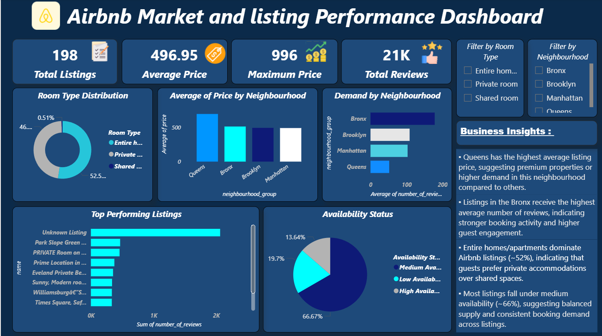

# 🏠Airbnb Market & Listing Performance Analysis

📌**Project Overview:**
This project analyzes Airbnb listings to understand market trends, pricing patterns, demand, and listing performance across different neighbourhoods using an interactive Power BI dashboard.
The dashboard transforms raw Airbnb data into actionable business insights that help identify high-demand locations, pricing trends, and popular room types.

----

🎯**Objectives:**
The main objectives of this project are:

- Analyze Airbnb listing distribution across neighbourhoods.
- Identify neighbourhoods with highest demand using review metrics.
- Compare pricing trends across locations.
- Understand room type preferences of guests.
- Analyze listing availability patterns.
- Identify top-performing listings based on reviews.

----

📊**Dashboard Features:**
KPI Metrics-
The dashboard highlights key performance indicators:
- Total Listings
- Average Price
- Maximum Price
- Total Reviews

----

📸**Dashboard Preview:**

🎛**Interactive Filters:**
The dashboard allows dynamic filtering using 
1. Neighbourhood Filter-
- Bronx
- Brooklyn
- Manhattan
- Queens

2. Room Type Filter-
- Entire Home
- Private Room
- Shared Room

These filters help explore location-specific trends and guest preferences.

----

🔍**Key Insights:**
- Queens has the highest average listing price, suggesting premium properties or stronger pricing in this neighbourhood.
- Bronx listings receive the highest average number of reviews, indicating higher booking demand.
- Entire homes dominate Airbnb listings (~52%), suggesting that guests prefer private accommodations.
- Most listings fall under medium availability (~66%), indicating balanced booking demand across properties.

----

📂**Dataset:**
The dataset includes Airbnb listing information such as:
- Listing ID
- Host details
- Neighbourhood group
- Room type
- Price
- Number of reviews
- Reviews per month
- Availability status
- Minimum nights

⚠️*Note:**
The full dataset was large, so a sample dataset is provided in this repository for demonstration purposes.

----

🛠**Tools & Technologies:**
- Power BI → Data visualization & dashboard creation
- SQL → Data exploration and analysis
- Dataset → Data storage and preprocessing

----

👩‍💻**Author:**
Harshita Pandey
| Aspiring Data Analyst
| SQL | Python | Power BI | Excel | Data Visualization
